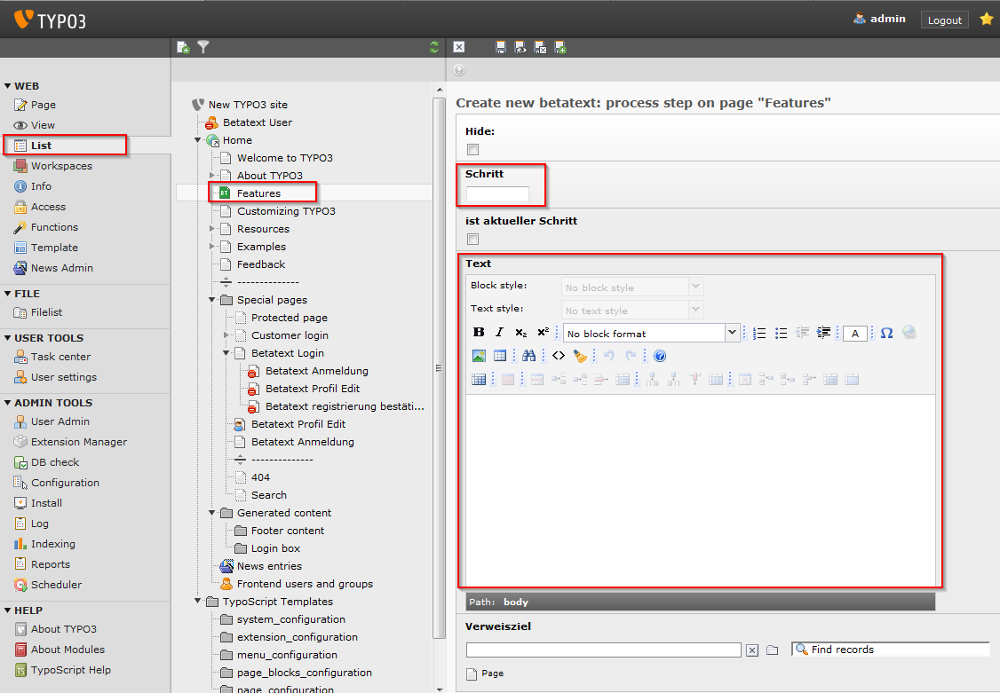

.. ==================================================
.. FOR YOUR INFORMATION
.. --------------------------------------------------
.. -*- coding: utf-8 -*- with BOM.

.. include:: ../../Includes.txt

.. _tutorial-adding-a-process-step:

Adding a process step
---------------------

If you want to show what process the document is going to go through, you can add betatext process
steps like this:

First, you need to modify the template once:

::

    fileadmin/default/templates/typo3-intro-template.html

Add the line

::

    

After the div with the id “mainContent” closes but before the div with the id “main” closes.

::

    

    

    

    

    [...]
    

        

    

    

    [...]
    

Switch to the list view of the betatext page and create a new record, then choose “betatext:
process step”. You may use numbers or symbols to identify the step and add an explanatory text.

|image-8| If you add a link, you may have to change the “loadContent” selector in the
appConfig.js to fetch the right text.

Add as much steps as you like. Again you may want to change the related css/scss code in the
“we_betatext/template” sub folder.
