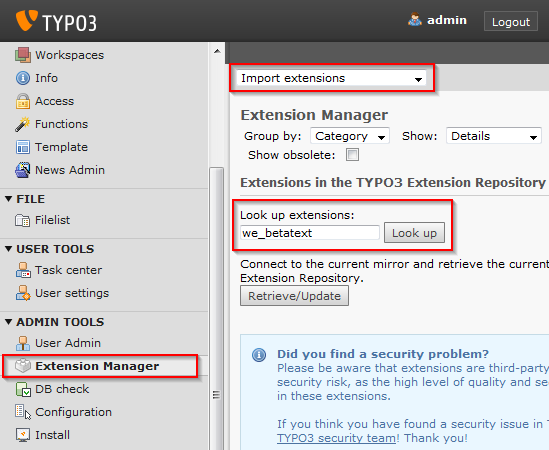
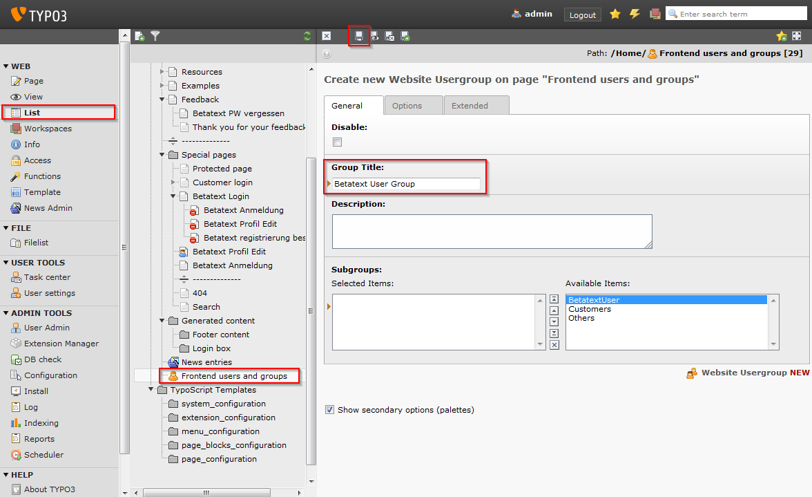
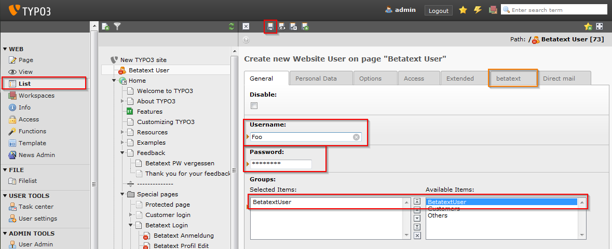
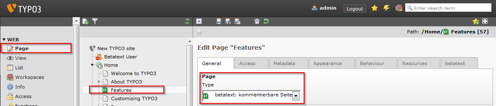
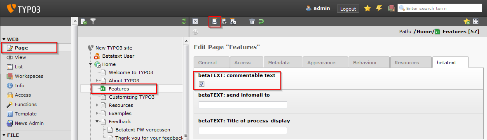
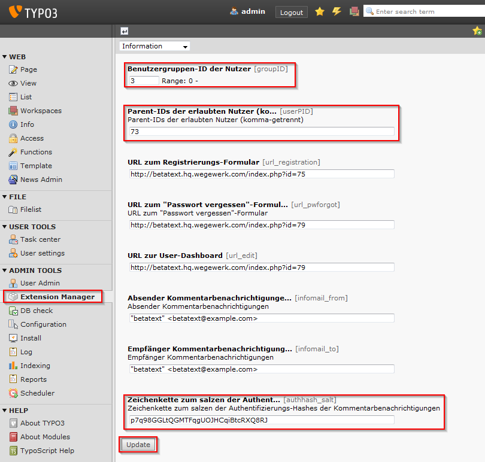
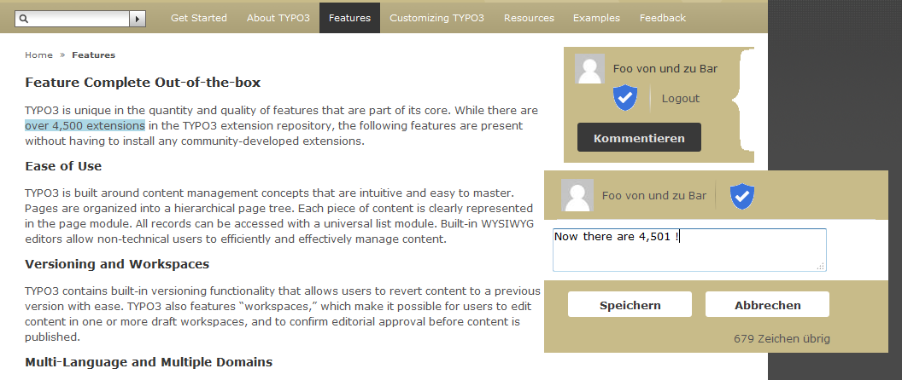

.. ==================================================
.. FOR YOUR INFORMATION
.. --------------------------------------------------
.. -*- coding: utf-8 -*- with BOM.

.. include:: ../Includes.txt

.. _tutorial:

Tutorial
========

<text:bookmark text:name="__RefHeading__943_776475755"/>For this tutorial we will use a fresh
installation of the typo3 introduction package (version 4.5). 

<text:bookmark text:name="__RefHeading__945_776475755"/>Download and install the
“saltedpasswords” as well as the “realurl” Extension.

Download and install the “we_betatext” Extension in the typo3 backend.

|image-9| Create a new usergroup in the “Frontend users and groups” Folder, e.g. “Betatext
User Group”.

Create a new folder (used for the user records) and call it “Betatext User”.

Create a new user in the folder, along the lines of username=foo, password=bar.

Add an rewrite-rule in the .htaccess file:

::

        RewriteRule rest\.php(/.*)$ index.php?eID=bbt&route=$1 [QSA,L,PT] 

Choose a page with some text and disable the right column, so we have enough space to show comments
there.

Now set the page type to “betatext” and activate “commentable text”.

|image-11| |image-12| 

Switch to the extension manager and configure the we_betatext extension:

- [dokType] – The doktype of commentable pages.
- [groupID] – The usergroup able to comment (the id of the “Betatext User Group”).
- [userPID] – The id of the folder containing the User (“Betatext User”).
- [authhash_salt] – Generate a random string with about 32 characters.

At this point, you should be able to log in with your test user “foo” and comment the text.

You probably want to change the css/scss and images in the “we_betatext/template” sub folder to
fit your needs.

If you do not want to create users by hand it is recommended to use a extension like
“sr_feuser_register” or similar.

.. toctree::
    :maxdepth: 2
    :titlesonly:

    AddingAProcessStep/Index
